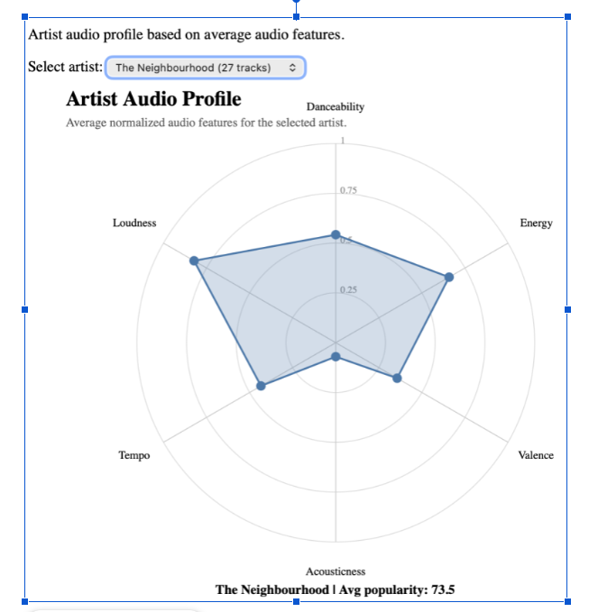

# Visualization 6 and 7

This visualization focuses on understanding how the audio characteristics of popular songs vary across artists and whether artists maintain a consistent musical profile. It targets these questions:

15. What is the average valence across popular music for a specific artist?
16. Has the average duration of popular tracks decreased according to popular artists?
18. Do specific top artists maintain a consistent audio profile, or do their tracks vary significantly in energy and danceability?
19. Is the overall acousticness of popular tracks increasing or decreasing across artists?
20. Do the loudness and tempo of tracks vary depending on the artists?

## Description

This section is implemented as an interactive **Artist Profile Dashboard** combining a radar chart and a temporal trend panel.

The radar chart displays the average audio profile of one or more selected artists across eight normalized dimensions: danceability, energy, valence, acousticness, loudness, tempo, **popularity**, and **duration**. Each axis runs from 0 to 1 after normalization so features with different units can be compared on the same shape. Hovering a vertex shows the raw average (for example valence on a 0–1 scale, loudness in dB, duration in minutes, or popularity on 0–100).

The trend panel shows line charts of a user-selected metric—duration, valence, acousticness, loudness, tempo, or popularity—across each artist’s catalog, with tracks ordered from most to least popular on the horizontal axis. This reveals whether an artist’s hits differ from deep cuts on that metric (for example shorter singles versus longer album tracks).

The dashboard is limited to the **12 top performers** in `Project/dataset.csv`, ranked by mean track popularity using each song’s primary credited artist (minimum 10 tracks): Eminem, Bad Bunny, Ariana Grande, Maluma, Frank Ocean, Travis Scott, Radiohead, The Neighbourhood, Stray Kids, System Of A Down, TWICE, and 2Pac. The list is stored in `top-12-performers.json` and loaded with `../dataset.csv` from the Project folder.

This dual-view approach helps users compare stylistic identity (radar) and within-catalog variation (trend lines) for the same artists.

**Why we chose this approach.** Questions 15–20 require both a **signature profile** per artist and a view of how features shift across that artist’s own tracks. A radar chart summarizes multi-feature identity in one shape, which bar charts would fragment across eight separate plots. Adding popularity and duration to the radar answers whether success and track length are part of an artist’s typical profile, not only timbre and mood. The trend panel complements the radar because averages can hide spread: an artist may look “consistent” on the radar while duration or acousticness still drifts from hit to hit. Line charts ordered by popularity make that drift readable. Restricting the picker to the top 12 artists keeps comparisons focused on widely represented, high-visibility acts in the corpus.

## Interactions

Searching in the artist filter box narrows the checkbox list among the top 12 artists.

Checking or unchecking an artist adds or removes that artist’s radar polygon and trend line; at least one artist should remain selected for a meaningful view.

Hovering over a point on the radar chart displays the artist name, the feature label, the raw average, and the normalized value (0–1).

Hovering over a point on the trend panel displays the artist, track title, popularity rank, and the metric value for the selected trend variable.

The trend metric dropdown switches the vertical axis between duration, valence, acousticness, loudness, tempo, and popularity while keeping the same popularity-based track order on the horizontal axis.

## Preview

*Figure 8. Average normalized artist audio profile (radar chart view)*

With one artist selected—for example a guitar-driven alternative act—the radar often shows moderate danceability and energy, lower acousticness, and mid-range valence, with loudness and tempo placed according to that artist’s mastering and pacing. The footer summary reports mean popularity and track count for the selection.

When several of the top 12 artists are selected, polygons overlap and show how acts differ on the same axes: some emphasize energy and loudness, others acousticness or duration. Question 18 is visible here: similar radar shapes suggest a stable profile, while uneven shapes or separated trend lines suggest more variation across the catalog.

In the trend panel, switching to **duration** supports question 16: if lines slope downward from rank 1 toward deeper catalog tracks, the artist’s most popular songs tend to be shorter than their less popular material. **Acousticness** and **valence** address questions 19 and 15: users can see whether hits cluster on one side of the scale. **Loudness** and **tempo** (question 20) often separate electronic or rock-leaning artists from slower, quieter profiles.

Together, the radar and trend views show that popular artists are not identical: each has a recognizable mean fingerprint, but individual tracks still move along duration, mood, and production dimensions when ordered by popularity.
